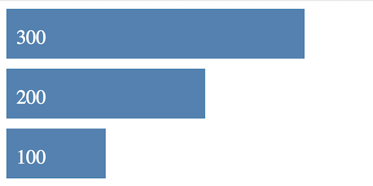
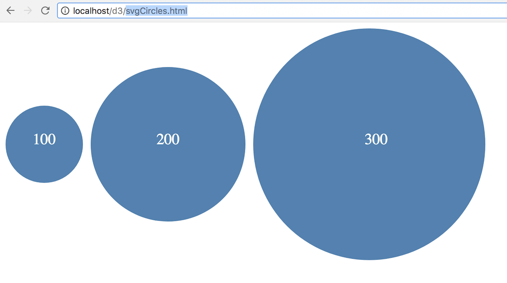
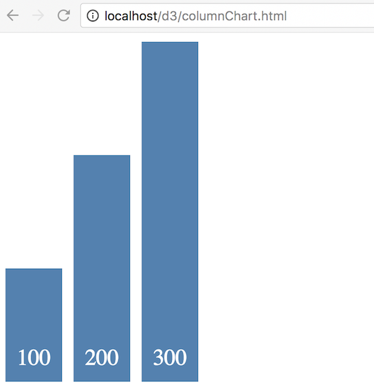
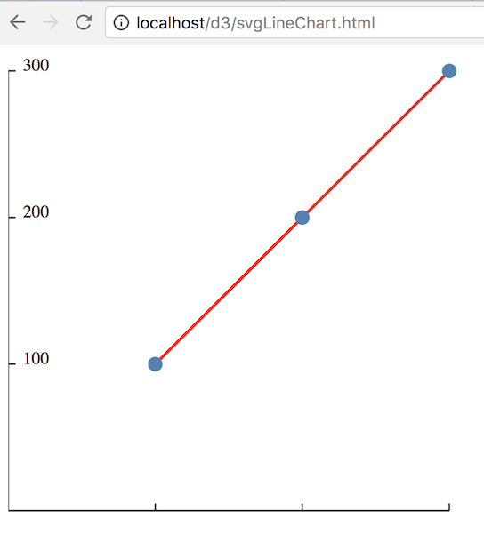
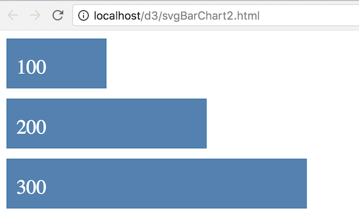

# D3 Exercise 1 – SVG

> Complete ALL the exercises in this section. Ask thomas.devine@lyit.ie for help.


## Clone the Remote Repository

This will copy some ``d3`` program files to your ``htdocs`` folder.  Pick one of the following two ways of downloading the repository.

### Clone by downloading ZIP file
Go to [this link](https://github.com/noucampdotorgSSAD2021/d3) and download the repository ZIP file.  Ensure you rename the folder downloaded as ``d3`` and copy this folder into your XAMPP ``htdocs`` folder.

### Clone by using git

Type these commands into your *Git Bash* client:

	```
	$ cd /<DRIVE>/xampp/htdocs   
	$ git clone https://github.com/noucampdotorgSSAD2021/d3.git d3
	$ cd d3
	$ dir or ls

	```

Check your ``htdocs`` folder.  You should have a new folder called ``d3`` with some files in it.


## Part 1

> It is important you know how to render SVG graphics BEFORE using D3.  Its similar to having to know HTML before using JavaScript

1.	Examine and open the file [http://localhost/d3/svgBarChart.html](http://localhost/d3/svgBarChart.html)

	It uses *SVG* to render a simple bar chart.  

	Using your code editor experiment/change some of the values, colours, etc. to see the outcome

1.	Modify the code in ``svgBarChart.html`` so that bar chart looks like this:

	

	Set the ``<svg>`` width to 300.


1.	Add the code to ``svgCircles.html`` to render this:

	

	The diameter of the circles are shown in the text values inside the circle.  Set the ``<svg>`` height to 300.

1.	Add the code to ``svgColumnChart.html`` for a new SVG rendered *column chart* like this:

	

	Set the ``<svg>`` height to 300.

1.	Add the code to ``svgLineChart.html`` to create a new SVG rendered *line chart* to look like this:

	


## Part 2

1.	Examine and open the code in [http://localhost/d3/svgBarChart2.html](http://localhost/d3/svgBarChart2.html) that uses SVG to render a simple bar chart dynamically using JavaScript.  
	
	Add another value to the ``data`` array and rerun the code.

1.	Modify the code so the output includes the text like this:

	

	Add the text dynamically using JavaScript.


