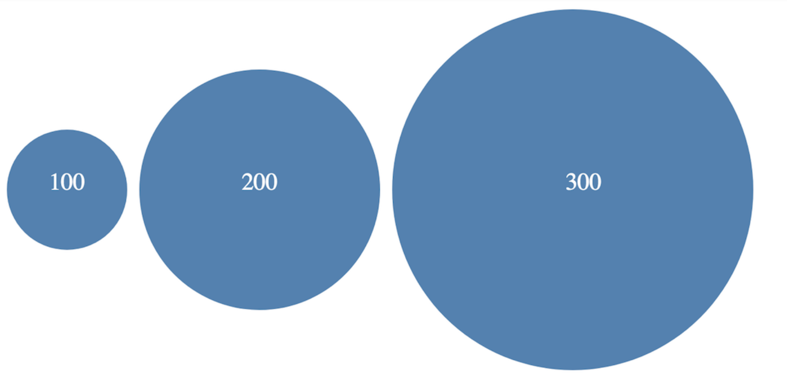
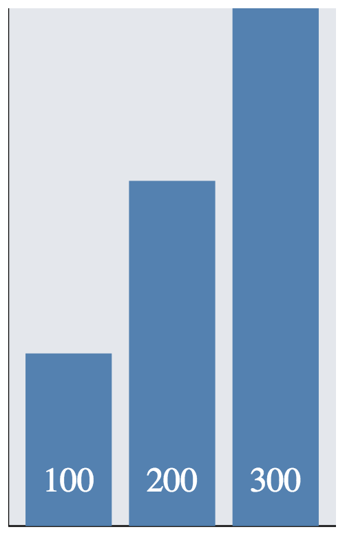
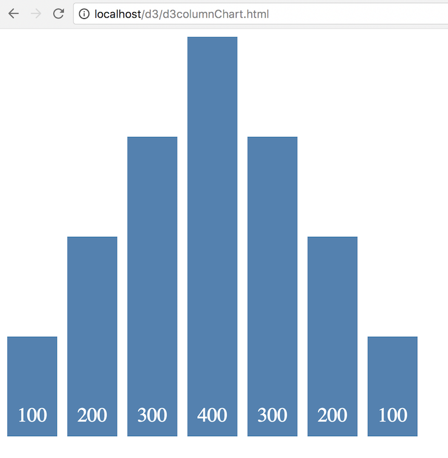
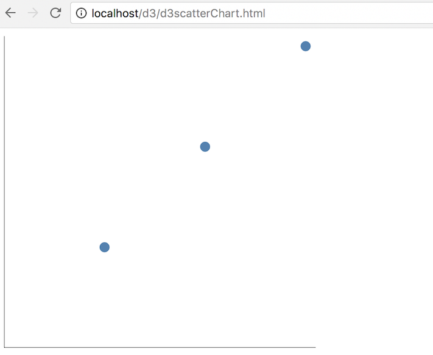
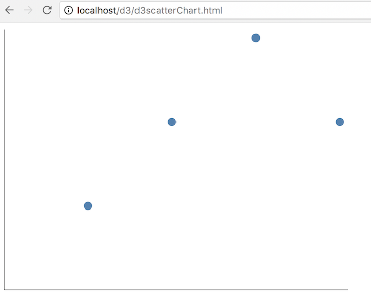
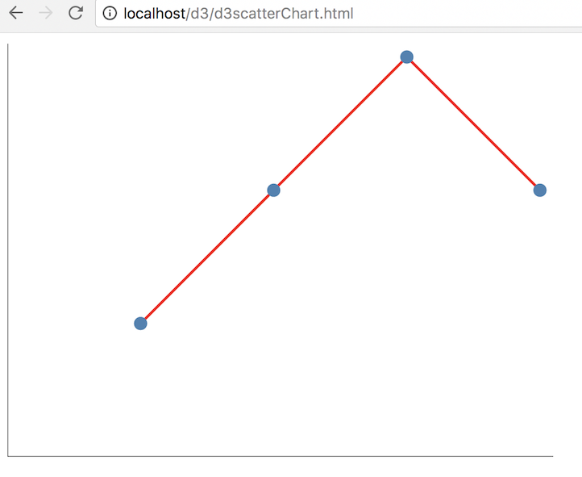

# D3 Exercise 2 – D3 Fundamentals
		
> Complete ALL the exercises in this section. Ask thomas.devine@lyit.ie for help

## Part 1

### Setup

You need to either use a direct copy of `d3` from [https://d3js.org/](https://d3js.org/) e.g.
```
<script src="https://d3js.org/d3.v6.min.js"></script>
```

**OR**

setup `d3` locally by downloading from [here](https://github.com/d3/d3/releases/download/v6.5.0/d3.zip) and save it in your ``d3`` folder.


### Exerises

1.	Examine and open the file [http://localhost/d3/d3BarChartJQ.html](http://localhost/d3/d3BarChartJQ.html)

1.	Modify the code in ``d3BarChartJQ.js`` to include text labels for the values of each bar.

1.	Examine and open the file [http://localhost/d3/d3Circles.html](http://localhost/d3/d3Circles.html)

1.	Modify the code in ``d3Circles.js`` to to render this using *d3* code:

	

1.	Examine and open the file [http://localhost/d3/d3Column.html](http://localhost/d3/d3Column.html)

1.	Modify the code in ``d3ColumnChart.js`` to to render this using *d3* code:

	

<!--
	1.	Examine and open the file [http://localhost/d3/d3BarChartV2.html](http://localhost/d3/d3BarChartV2.html)

	1.	Modify the code in ``d3BarChartV2.js`` to include text labels for the values of each bar.

		

		Hint: After the code that adds the ``rect`` elements use this code to get you started:

		```javascript

		elements.enter().append("text")
			...
			...

		```

	1.	Add some extra values to the ``dataset`` array.  Modify the code as appropriate to see these extra values rendered as new bars.

	1.	Push your code to **your private** repository on GitHub.  Type these commands into your *Git Bash* client:

		```
		$ git status
		$ git add .
		$ git commit -m "Exercise 2 Part 1 - DONE|PARTIAL|HELP"
		$ git push origin master
		$ git status

		```


	## Part 2

	1.	Open the files - ``d3ColumnChart.html`` and ``d3ColumnChart.js`` and add the code that renders this new *column chart*:

		

		using the dataset given:

		```javascript
		var data = [100,200,300,400,300,200,100];

		```

	1.	Modify your solution so that no *magic numbers* are embedded in your code.  For example, use these constants for controlling spacing between bars and the width of bars.

		```javascript
		const spacing = 10;
		const barwidth = 50;	

		```

	1.	Modify your code to use this dataset:

		```javascript
		var data = [100,200,300,800,300,200,100];

		```	

		The middle value is now 800.  Does your chart height automatically increase to accomodate this new value?  Modify your code so the height of the ``<svg>`` is dynamically set using the largest value in the ``dataset`` array.

	1.	Modify your code to use this dataset:

		```javascript
		var data = [100,200,300,400,300,200,100,400,300,200,100];

		```	

		Modify your code to accomodate these extra bar values dynamically too.

	1.	Push your code to **your private** repository on GitHub.  Type these commands into your *Git Bash* client:

		```
		$ git status
		$ git add .
		$ git commit -m "Exercise 2 Part 2 - DONE|PARTIAL|HELP"
		$ git push origin master
		$ git status

		```

	## Part 3

	1.	Open the files - ``d3ColumnChartV3.html`` and ``d3ColumnChartV3.js`` and modify the code so the bars appear with the data labels as shown here:

		

		Notice how the dataset is now a JSON array.  

	1.	Push your code to **your private** repository on GitHub.  Type these commands into your *Git Bash* client:

		```
		$ git status
		$ git add .
		$ git commit -m "Exercise 2 Part 3 - DONE|PARTIAL|HELP"
		$ git push origin master
		$ git status

		```

	## Part 4

	1.	Modify the files ``d3ScatterChart.html`` and ``d3ScatterChart.js`` to render this scatter plot chart:

		

	1.	Update the ``data`` array to this:

		```javascript
		var data = [{"x":100,"y":100},{"x":200, "y":200},{"x":300,"y":300},{"x":400, "y":200}];

		```

		Refresh the chart in the browser.  It should show this chart:

		

		Attempt to update your code to allow for this automatic update.

	1.	Finally, use the d3 *line generator* to draw the lines between the points as shown here:

		

	1.	Push your code to **your private** repository on GitHub.  Type these commands into your *Git Bash* client:

		```
		$ git status
		$ git add .
		$ git commit -m "Exercise 2 Part 4 - DONE|PARTIAL|HELP"
		$ git push origin master
		$ git status

		```

-->