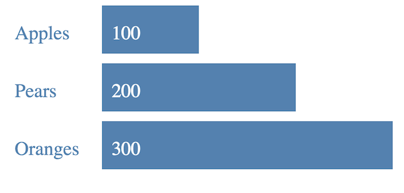

# D3 Exercise 4 – D3 Data Fetching
		
> Complete ALL the exercises in this section. Ask thomas.devine@lyit.ie for help.

## Part 1

1.	Examine and open the file [http://localhost/d3/d3JSON1jq.html](http://localhost/d3/d3JSON1jq.html) that retrieves JSON data from a JSON file.

    Modify some of the values in the ``numbers.json`` and refresh the bar chart.

1.	Import the MySQL database [d3](http://localhost/d3/d3.sql) into XAMMP MySQL Server.  

1.  Run the PHP script [http://localhost/d3/d3JSON2.php](http://localhost/d3/d3JSON2.php) that retrieves JSON data from the database.  
    Notice that it returns 3 names & value fields.

1.  Open and understand the code [http://localhost/d3/d3JSON2jq.html](http://localhost/d3/d3JSON2jq.html) that uses the PHP script to retrieve JSON data.

1.  Modify the code in ``d3JSON2jq.js`` so the bar chart renders this from the JSON data fetched:

    

1.  In the ``d3`` database insert another fruit name and value record (e.g. Bananas, 400) to the ``d3table`` table.  
    When you refresh [http://localhost/d3/d3JSON2jq.html](http://localhost/d3/d3JSON2jq.html) it should render the new fruit details appropriately.

