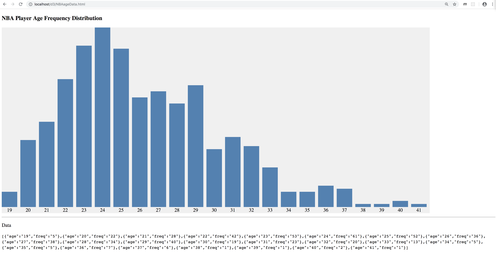

# D3 Exercise 5 – D3 Linear Scaling
		
> Complete ALL the exercises in this section. Ask thomas.devine@lyit.ie for help.


## Part 1

1.	Examine and open the code solution [http://localhost/d3/d3scale2JQ.html](http://localhost/d3/d3scale2JQ.html) that performs linear scaling on the `dataset` array values.

    Modify some of the values in the ``dataset`` array and refresh the bar chart.

1.  Find the code below in `d3scale2JQ.js`.  Modify it so the largest data value for _domain()_ is automatically retrieved from the `dataset` and the current `<svg>` width value is automatically retrieved for the _range()_ max value.

    ```javascript
    var w = d3.scaleLinear()
            .domain([0,300])
            .range([0,600]); 
    ```

    Test your solution works by modifying both the `<svg>` width and the largest value in the `dataset` array.

1.  Modify your solutions to `d3BarChart2JQ.html` and `d3BarChart2JQ.js` to also use linear scaling appropriately.

1.  Modify your solutions to `d3ColumnChartJQ.html` and `d3ColumnChartJQ.js` to use linear scaling for the **height** of the columns.
    
    Again test your solution thoroughly by modifing the dataset and svg heights.

    Hint: Remember to scale all occurances of data values used from the dataset.


## Part 2 - NBA Player Age Frequency Distribution

1.  You are going to recreate this column chart that helps visualise the age frequency distribtion of NBA players:

    

1.  Firstly, setup the [nba2018](../nba2018.sql) database on your XAMMP MySQL Server.  Examine the contents of this database.  
    You are going to fetch the data needed from this database.

1.	Open and examine the partial code solution [http://localhost/d3/NBAageDataJQ.html](http://localhost/d3/NBAageDataJQ.html) and [http://localhost/d3/NBAageData.js](http://localhost/d3/NBAageData.js)

1.  Write a PHP script `NBAgetAgeData.php` that retrieves the age data from the database.  This script will be called to fetch the JSON data needed to render the column chart.  This script should return JSON data like this:

    ```javascript
    [{"age":"19","freq":"5"},{"age":"20","freq":"22"},{"age":"21","freq":"28"},{"age":"22","freq":"42"},{"age":"23","freq":"53"},{"age":"24","freq":"61"},{"age":"25","freq":"52"},{"age":"26","freq":"36"},{"age":"27","freq":"38"},{"age":"28","freq":"34"},{"age":"29","freq":"40"},{"age":"30","freq":"19"},{"age":"31","freq":"23"},{"age":"32","freq":"20"},{"age":"33","freq":"13"},{"age":"34","freq":"5"},{"age":"35","freq":"5"},{"age":"36","freq":"7"},{"age":"37","freq":"6"},{"age":"38","freq":"1"},{"age":"39","freq":"1"},{"age":"40","freq":"2"},{"age":"41","freq":"1"}]
    ```

    Show the JSON data retrieved in the `<code>` element in the `NBAageDataJQ.html` page.

    Note: If you cannot write the solution for this PHP script ask for a solution.

1.  Perform the following tasks to render the column chart:

    - work out the `width` of the `<svg>` from the number of values (columns) that need to be rendered
    - the `height` of the `<svg>` should not be changed.  Use linear scaling to accomodate the columns
    - render the columns and age labels as shown in the image above 

