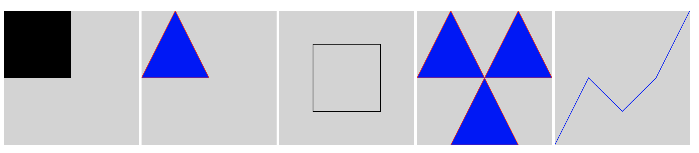
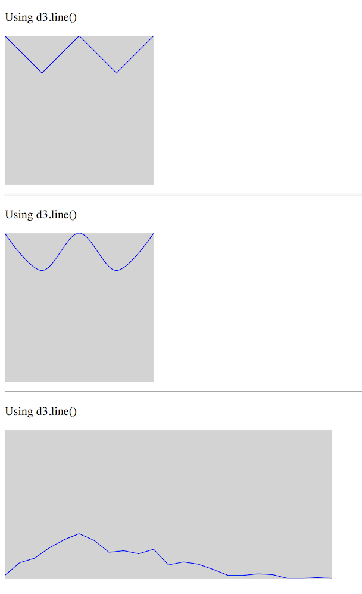

# D3 Exercise 6 – D3 Path & Generators
		
> Complete ALL the exercises in this section. Ask thomas.devine@lyit.ie for help.

## Part 1 - SVG Path Element

1.	Open the code [http://localhost/d3/d3Path.html](http://localhost/d3/d3Path.html) and modify the code to render these using the `<path>` SVG element only:

    

## Part 2 - D3 Line Generator

1.	Open the code [http://localhost/d3/d3lineGeneratorJQ.html](http://localhost/d3/d3lineGeneratorJQ.html) and modify the code to render these using line generators:

    

Use the ``dataset2`` array for the third line above.

## Part 3 - D3 Area Generator

1.	Open the code [http://localhost/d3/d3areaGeneratorJQ.html](http://localhost/d3/d3areaGeneratorJQ.html) and modify the code to render these using an area generator:

    

