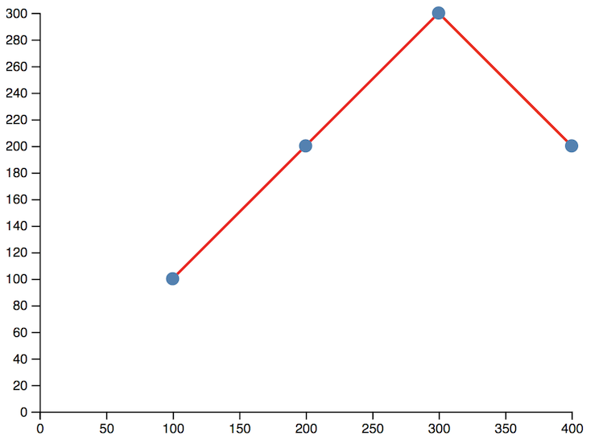

# D3 Exercise 7 – D3 Grouping & Basic Axes
		
> Complete ALL the exercises in this section. Ask thomas.devine@lyit.ie for help.

<!-- ## Fetch latest Repository Branch

```
$ cd /DRIVE/xampp/htdocs/d3
$ git pull --no-edit https://github.com/noucampdotorgSSAD2019/d3.git latest
$ git status

``` -->


## Part 1 - Grouping

1.	Run and view the code [http://localhost/d3/group1.html](http://localhost/d3/group1.html).

1.  Open the browser _Elements_ console tab and view where the `<g>` element is.

1.  Open your solution to a previous SVG chart called `d3ColumnChart.js`.  

    Add all existing SVG elements to a new `<g>` element.  Ensure the chart renders like before.

1.  Use the SVG attribute `transform` to move the contents of the entire column chart in  `d3ColumnChart.js` to the right a number of pixels.

## Part 2 - Axes

1.	Run and view the code [http://localhost/d3/d3Axes1.html](http://localhost/d3/d3Axes1.html)

1.  Open your solution to a previous SVG chart called `d3scatterChart.js`.  Add the x and y axes seen here:

    

    In your solution make sure you use:

    - grouping using `<g>`
    - x and y axis generators
    - `<path>` for line
    - `<circle>` for dots

    The following margins were used around the SVG

    ```javascript
    var margin = {left:25, right:25, top:5, bottom:25};
    ```

<!-- 1.	Push your code to **your private** repository on GitHub.  Type these commands into your *Git Bash* client:

    ```
    $ git status
    $ git add .
    $ git commit -m "Exercise 7 - DONE|PARTIAL|HELP"
    $ git push origin master
    $ git status

    ``` -->


